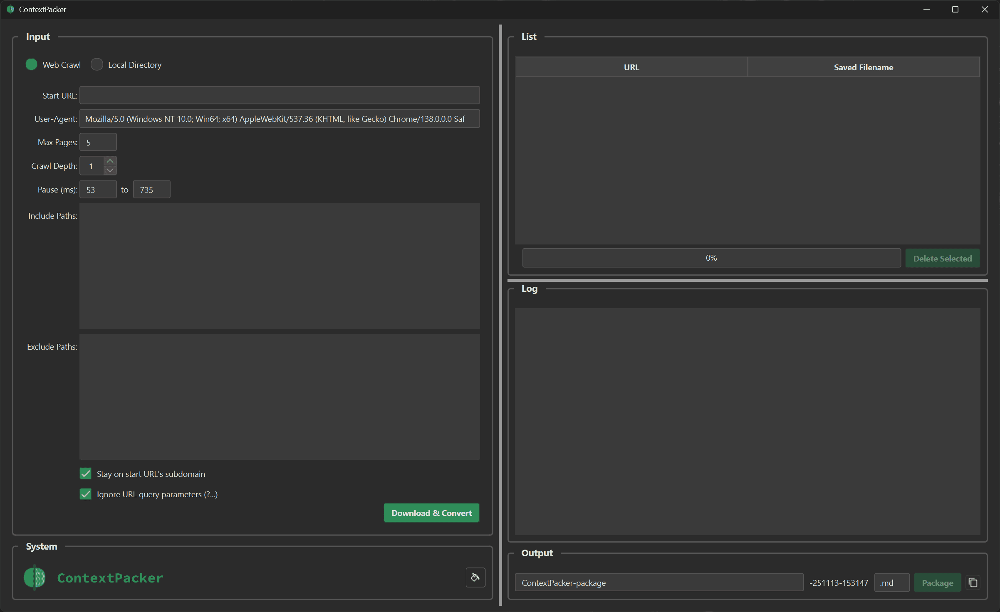

#  ContextPacker: LLM Optimised Content Scraper

A desktop app to scrape websites, Git repositories, or package local files into a single file, optimized for consumption by LLMs.
ContextPacker is a desktop application designed to scrape websites, clone Git repositories, or package local files into a single output file, **optimised for consumption by Large Language Models (LLMs)**.



-----

## ✨ Features

* **Content Sources:**
  * **Web Crawling:** Scrape a website, convert pages to **Markdown**, and package into one file.
  * **Git Repository Cloning:** Enter a Git URL to automatically clone the repo and switch to local packaging.
  * **Local Packaging:** Package a local directory (e.g., a code repository) into a single file.
* **Output & Filtering:**
  * **Multiple Formats:** Package files as `.md`, `.txt`, or `.xml`.
  * **Smart Filtering:** Automatically respects **`.gitignore`** rules and allows hiding common binary and image files.
* **Customisability:**
  * **Customisable Settings:** Configure scraping options (depth, paths, speed) and file exclusions.
  * **External Configuration:** Key settings (`user_agents`, `default_local_excludes`, `binary_file_patterns`) can be modified in a **`config.json`** file created on first run.
* **Cross-Platform:** Supports Light and Dark themes (detects system theme on Windows, macOS, and Linux).

-----

## 💻 Usage Modes

The application operates in two main modes, selected via radio buttons:

### Web Crawl Mode (for online content)

1. Select **"Web Crawl"**.
2. Enter the **Start URL**.
      * For a website, enter the full URL to begin scraping.
      * For a **Git repository**, enter the clone URL (e.g., `https://github.com/user/repo.git`). The app will detect this, clone the repository, and switch to Local Directory Mode.
3. Adjust crawling options (ignored for Git URLs).
4. Click **"Download & Convert"**.

### Local Directory Mode (for local files)

1. Select **"Local Directory"**.
2. Choose the **Input Directory**.
3. Use the **Excludes** text area for patterns to exclude (combined with `.gitignore` rules).
4. Use checkboxes to include subdirectories or hide common binary/image files.
5. Click **"Package"**. The packaged file will be saved in your Downloads folder using the selected output format.

-----

## ⚙️ Installation & Setup

### Requirements

To use all features, ensure you have the following installed:

1. **Git:** Must be installed and accessible in your system's PATH (required for Git cloning).
2. **Python and Poetry:** A modern version of **Python (3.12+)** and **Poetry** (used for dependency management).

### Steps to Run from Source

1. Clone the repository or download the source code.
2. Install dependencies using Poetry:

    ```sh
    poetry install
    ```

3. Run the application:

    ```sh
    poetry run python app.py
    ```

-----

## 🛠️ Building from Source

This project uses **Nox** for task automation. Ensure Nox is installed (`poetry install`). Run these commands from the project root:

* **Build for Production:** Creates a compressed archive (`.7z` or `.zip`) in the `dist` folder.

    ```sh
    poetry run nox -s build
    ```

* **Build and Run for Debugging:** Builds a version with the console enabled and launches it.

    ```sh
    poetry run nox -s build-run
    ```

* **Clean Build Artifacts:** Removes `dist`, `build`, and `__pycache__` directories.

    ```sh
    poetry run nox -s clean
    ```
