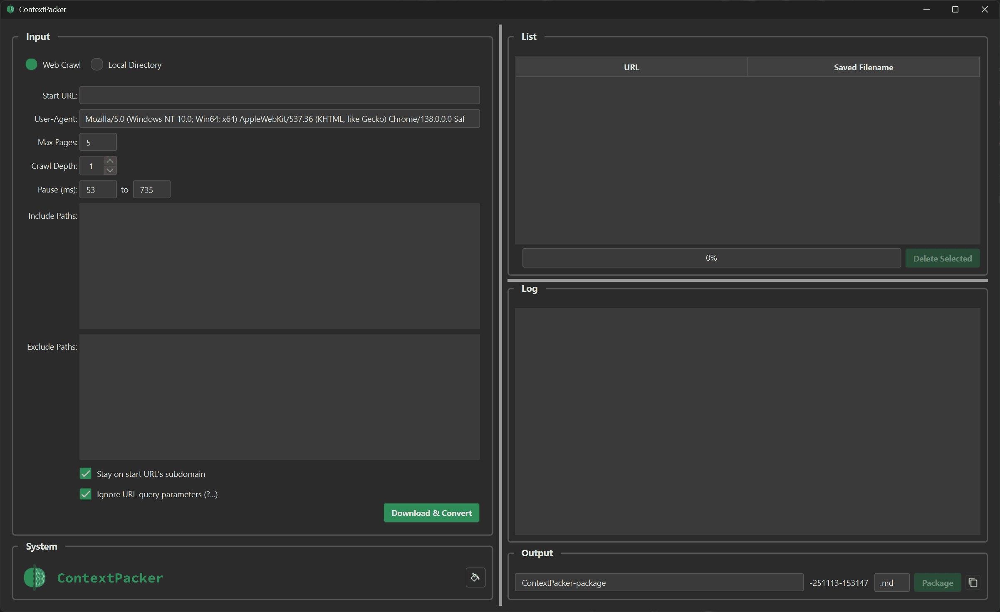

#  ContextPacker: LLM Optimised Content Scraper

A desktop app to scrape websites, Git repositories, or package local files into a single file, optimized for consumption by LLMs.
ContextPacker is a desktop application designed to scrape websites, clone Git repositories, or package local files into a single output file, **optimised for consumption by Large Language Models (LLMs)**.



-----

## ✨ Features

- **Content Sources:**
  - **Web Crawling:** Scrape a website, convert pages to **Markdown**, and package into one file.
  - **Git Repository Cloning:** Enter a Git URL to automatically clone the repo and switch to local packaging.
  - **Local Packaging:** Package a local directory (e.g., a code repository) into a single file.
- **Output & Filtering:**
  - **Multiple Formats:** Package files as `.md`, `.txt`, or `.xml`.
  - **Smart Filtering:** Automatically respects **`.gitignore`** rules and allows hiding common binary and image files.
- **Customisability:**
  - **Customisable Settings:** Configure scraping options (depth, paths, speed) and file exclusions.
  - **External Configuration:** Key settings (`user_agents`, `default_local_excludes`, `binary_file_patterns`) can be modified in a **`settings.json`** file created on first run.
- **Cross-Platform:** Supports Light and Dark themes (detects system theme on Linux, macOS, and Windows).

-----

## 💻 Usage Modes

The application operates in two main modes, selected via radio buttons:

### Web Crawl Mode (for online content)

1. Select **"Web Crawl"**.
2. Enter the **Start URL**.
      - For a website, enter the full URL to begin scraping.
      - For a **Git repository**, enter the clone URL (e.g., `https://github.com/user/repo.git`). The app will detect this, clone the repository, and switch to Local Directory Mode.
3. Adjust crawling options (ignored for Git URLs).
4. Click **"Download & Convert"**.

### Local Directory Mode (for local files)

1. Select **"Local Directory"**.
2. Choose the **Input Directory**.
3. Use the **Excludes** text area for patterns to exclude (combined with `.gitignore` rules).
4. Use checkboxes to include subdirectories or hide common binary/image files.
5. Click **"Package"**. The packaged file will be saved in your Downloads folder using the selected output format.

-----

## 🔧 Advanced Configuration (`settings.json`)

The application creates a `settings.json` file on first run in the application data directory (`~/.config/ContextPacker` on Linux). This file contains settings that are only read once on startup and are intended to be user-managed.

| Key | Description | Default Value | Notes |
| :--- | :--- | :--- | :--- |
| `logging_level` | Sets the verbosity of the internal log output. | `"INFO"` | Options: `"DEBUG"`, `"INFO"`, `"WARNING"`, `"ERROR"`, `"CRITICAL"`. |
| `log_max_size_mb` | Maximum size (in megabytes) of the `app.log` file before log rotation occurs. | `3` | |
| `log_backup_count` | Number of backup log files to keep during rotation. | `5` | |
| `user_agents` | A list of strings used by the web crawler to identify itself. | `[...]` | The application cycles through these. |
| `default_output_format` | The default file extension selected in the Output panel. | `".md"` | Options: `".md"`, `".txt"`, `".xml"`. |
| `default_local_excludes` | A list of global `fnmatch` patterns automatically applied to local directory scans. | `[".archive/", ".git/", ...]` | These are visible and editable in the 'Excludes' text area. |
| `binary_file_patterns` | A list of `fnmatch` patterns that are considered binary/image files and can be toggled via the 'Hide Images + Binaries' checkbox. | `[*.png, *.jpg, ...]` | |
| `max_age_cache_days` | The number of days after which old, temporary session and cache directories are automatically deleted on startup. | `7` | Set to a high number to keep all cache files indefinitely. |

The file also contains window-state keys (`window_size`, `h_sash_state`, etc.) which are managed automatically by the application on close.

-----

## ⚙️ Installation & Setup

### Requirements

To use all features, ensure you have the following installed:

1. **Git:** Must be installed and accessible in your system's PATH (required for Git cloning).
2. **Python and uv:** A modern version of **Python (3.10+)** and **uv** (used for dependency management).

### Steps to Run from Source

1. Clone the repository or download the source code.

2. Sync dependencies using uv:

   ```sh
   uv pip list --outdated
   uv lock --upgrade
   uv sync
   ```

3. Run the application:

   ```sh
   uv run Python app.py
   ```

-----

## Building from Source

This project uses **Nox** for task automation. Run these commands from the project root:

- **Build for Production** — creates a compressed archive (`.7z` or `.zip`) in `dist/`:

    ```sh
    uv run nox -s build
    ```

- **Build and Run (Debug)** — builds with console enabled and launches the app:

    ```sh
    uv run nox -s build_run
    ```

- **Clean Artifacts** — removes `dist/`, `build/`, and `__pycache__`:

    ```sh
    uv run nox -s clean
    ```

## Development

```text
uv run ruff check           # lint
uv run ruff check --fix     # lint + auto-fix
uv run ruff format          # format
```

## Installation

### Linux

```text
7za x dist/ContextPacker-Linux-x64-v*.7z
sudo cp -r ContextPacker /opt/
sudo ln -s /opt/ContextPacker/ContextPacker /usr/local/bin/contextpacker
```
